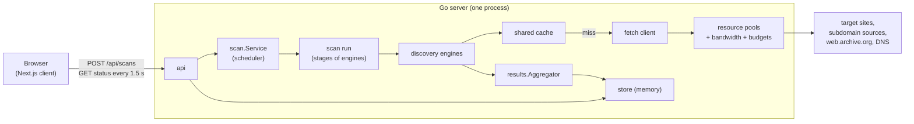
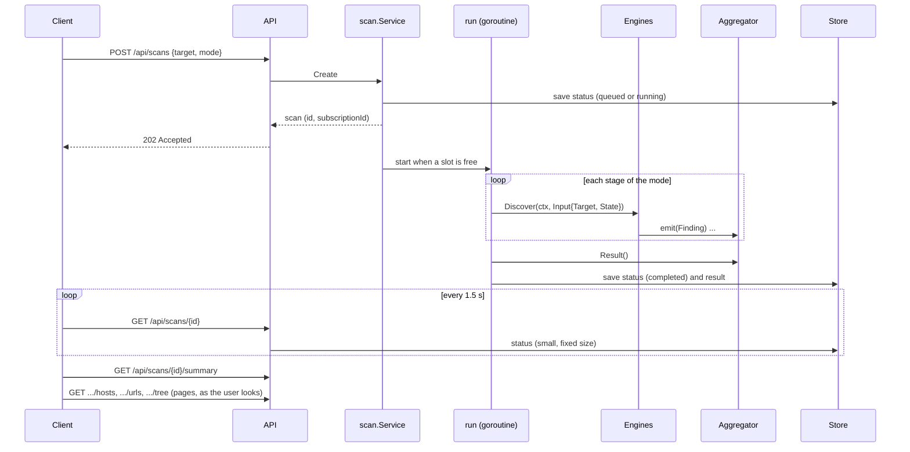
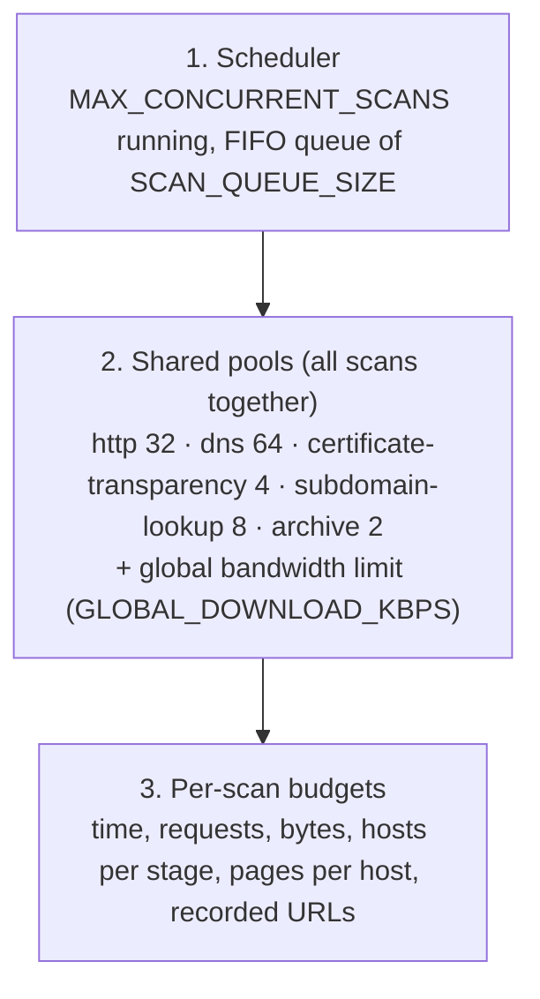

# Architecture

This document is for people who want to understand or change Web Scanner.
It explains how the pieces fit together, why they are built the way they
are, and where to start when adding something. For running and deploying
the project see the [README](README.md); for the HTTP API and every setting
see [server/README.md](server/README.md).

- [What the system does](#what-the-system-does)
- [Repository layout](#repository-layout)
- [The big picture](#the-big-picture)
- [Life of a scan](#life-of-a-scan)
- [Scan modes and the pipeline](#scan-modes-and-the-pipeline)
- [Discovery engines](#discovery-engines)
- [From findings to results](#from-findings-to-results)
- [Outbound requests: the fetch client](#outbound-requests-the-fetch-client)
- [Resource management](#resource-management)
- [The shared discovery cache](#the-shared-discovery-cache)
- [Scheduler, coalescing and cancellation](#scheduler-coalescing-and-cancellation)
- [Storage and memory](#storage-and-memory)
- [The HTTP API](#the-http-api)
- [The web client](#the-web-client)
- [Safety rules](#safety-rules)
- [Configuration](#configuration)
- [Testing](#testing)
- [Why is it built like this?](#why-is-it-built-like-this)
- [Extending the scanner](#extending-the-scanner)
- [Known rough edges](#known-rough-edges)
- [Glossary](#glossary)

## What the system does

Given a domain, Web Scanner lists what is publicly discoverable about it:
its **hosts** (the domain and its subdomains) and the **URLs** on each host
(pages, API-like endpoints, assets). Every result records **how it was
found** (its provenance), because the product's promise is "here is what we
could discover, and why we think so", not "here is everything that exists".

It is a discovery tool, not a vulnerability scanner. It only reads public
sources, sends ordinary `GET` requests at a polite rate, never submits forms,
never guesses paths or brute-forces names, and never contacts private
networks.

It is designed to run on a small shared server (for example 2 vCPU / 2 GiB
RAM next to other services) while several people scan large sites at once.
That constraint explains most of the design.

## Repository layout

```text
.
├── server/                 Go API: scheduler, discovery engines, results
│   ├── cmd/server/         main: configuration → pools/caches → pipeline → API
│   ├── internal/
│   │   ├── api/            REST handlers, gzip, health
│   │   ├── scan/           scan model, scheduler, coalescing, stage runner
│   │   ├── discovery/      Engine contract, Finding, Target/scope, host helpers
│   │   │   ├── subdomains/ certificate logs and public subdomain databases
│   │   │   ├── archive/    web archive (Wayback Machine CDX index)
│   │   │   ├── dnsresolve/ DNS resolution
│   │   │   ├── httpprobe/  is a host live? (one GET per host)
│   │   │   ├── sitemap/    robots.txt and XML/text sitemaps
│   │   │   └── htmlcrawl/  crawler (HTML link extraction, page cache)
│   │   ├── results/        Aggregator: merges findings into hosts → URLs
│   │   ├── classify/       page / api / asset / unknown, always with evidence
│   │   ├── normalize/      canonical URLs and hostnames (deduplication keys)
│   │   ├── fetch/          the one outbound HTTP client (limits, SSRF guard)
│   │   ├── resource/       shared pools, per-scan accounts, bandwidth limiter
│   │   ├── cache/          bounded TTL cache with single-flight loading
│   │   ├── store/          scans and results on disk, one SQLite file per scan
│   │   ├── config/         environment variables
│   │   └── htmlmeta/       <title> extraction
│   └── deploy/             systemd unit and a small-server profile
└── client/                 Next.js web UI (TypeScript, Tailwind CSS)
    └── src/
        ├── app/            pages: home, scan (progress → results)
        ├── components/     scan form, progress, results views
        └── lib/            API client and types, polling hook, formatting
```

The two halves are separate programs. The client only talks to the server's
REST API.

## The big picture



The request path is short: the API creates a scan and returns at once; a
background goroutine runs the scan; the client polls a small status record
until the scan finishes, then downloads the result once.

## Life of a scan



1. **Create** ([scan/service.go](server/internal/scan/service.go)). The target
   is parsed and scoped ([discovery/target.go](server/internal/discovery/target.go)):
   `https://www.example.com/docs` becomes start URL
   `https://www.example.com/docs` with scope `example.com` and all its
   subdomains. IP addresses, custom ports and local names are rejected.
2. **Queue or join.** If an equivalent scan is already queued or running, the
   request joins it (see [coalescing](#scheduler-coalescing-and-cancellation)).
   Otherwise the scan waits in a FIFO queue until one of
   `MAX_CONCURRENT_SCANS` slots is free.
3. **Run.** The scan gets its own context (cancelled by the user, the scan
   time limit or shutdown) carrying a resource *account* (its request and
   download budgets). The entered host and the apex domain are added as
   hosts, then the stages of the scan's mode run in order (the web archive
   in the background, alongside the others). Every engine reads what earlier
   engines found and reports new findings.
4. **Progress.** Once a second the service writes fixed-size counters (hosts
   resolved, pages fetched, pending work, limits reached) to the status
   record. The status never contains the hosts or URLs themselves, so polling
   costs the same for any scan size. Every few seconds it also saves a
   snapshot of the result so far, which is what the result endpoints return
   while the scan runs.
5. **Finish.** The aggregator builds the result; the status gets its final
   state and any stop reason; the result is stored separately from the status.

A scan ends as `completed`, `failed` (every engine failed) or `cancelled`.
A scan that hits its time limit is `completed` with `stopReason:
"scan_timeout"`: its results are kept and labelled as partial.

## Scan modes and the pipeline

The pipeline is an ordered list of **stages**, defined in `pipeline()` in
[cmd/server/main.go](server/cmd/server/main.go). A stage is one visible
progress step and holds one or more engines. Each stage lists the modes it
runs in; a scan only runs the stages of its mode.

| Stage | passive | light | full | Engines |
| --- | :-: | :-: | :-: | --- |
| Searching web archives (background) | ✓ | ✓ | ✓ | `archive` |
| Searching certificate logs (background) | ✓ | ✓ | ✓ | `subdomains` (slow sources) |
| Discovering subdomains | ✓ | ✓ | ✓ | `subdomains` (quick sources) |
| Resolving discovered hosts | ✓ | ✓ | ✓ | `dns` |
| Checking which hosts are live | | ✓ | ✓ | `http` |
| Reading robots.txt and sitemaps | | ✓ | ✓ | `sitemap` |
| Crawling reachable hosts | | | ✓ | `html` |
| Follow-up for hosts found later (joins the archive) | ✓ | ✓ | ✓ | the same engines again |

- **passive** never contacts the target: certificate logs, the web archive
  and DNS only. Archived routes are historical and unverified.
- **light** (the default, shown as "Standard" in the UI) adds one request per
  host to see if it is live, plus its robots.txt and sitemaps.
- **full** also crawls pages and follows links.

Stages run in order, with one exception. A stage marked `Background` is
started in its turn and the stages after it run alongside it; a stage marked
`Join` first waits for every background stage. The web archive is the
background stage, and so are the slow certificate-log providers: they are
slow third parties and nothing needs to wait for them, so hosts from the
quick sources are resolved and probed while they answer. A background stage
can also set `JoinWait`: the scan then waits only that long for it once
everything else is done. The certificate-log stage does (5 s); the archive
does not, because its listing is the bulk of the result.
The follow-up stage joins it, which is how hosts only the archive knows
still get checked.

Engines that act on hosts only process hosts they have not handled before,
so the follow-up stage can run the same engine instances again for hosts
first seen by the archive, in sitemaps, links or redirects. There is exactly one follow-up
round; hosts first seen in that round are listed and reported as unchecked
(`discovery_round_limit`), so discovery can never recurse without bound.

## Discovery engines

Everything the scanner learns comes from an engine. The contract is small
([discovery/engine.go](server/internal/discovery/engine.go)):

```go
type Engine interface {
    Name() string
    Discover(ctx context.Context, in Input, emit Emit) error
}

type Input struct {
    Target Target // the scanned domain and its scope
    State  State  // read-only view: hosts and unfetched page URLs so far
}
```

An engine reads `State`, does its work and calls `emit(Finding)` for every
observation. A **Finding** is either about a URL (a link, a sitemap entry, a
fetched page with its response metadata) or about a host (a DNS answer, a
probe result, a crawl summary). Engines never merge, deduplicate or classify:
that is the aggregator's job. Returning an error marks the engine as failed
for this scan but never fails the whole scan; `discovery.Partial(err)`
reports a failure that still produced results (for example one of two
certificate providers failing).

| Engine | Package | What it does | Requests to the target |
| --- | --- | --- | --- |
| `subdomains` | `discovery/subdomains` | Asks public sources (in parallel) for names under the domain and keeps in-scope hostnames. Two instances: the quick sources (Shodan's certificate search, AnubisDB, ip.thc.org) in the foreground, the slow certificate logs (crt.sh, Cert Spotter) in the background | none |
| `archive` | `discovery/archive` | The Wayback Machine CDX index for the domain and all subdomains, a page of 25,000 URLs at a time: URLs archived with HTTP 200, first capture date, content type; drops malformed junk. Reported as it arrives, so memory stays at one page | none |
| `dns` | `discovery/dnsresolve` | One A question per host to public resolvers, whose answer carries the alias chain (AAAA only if there is no IPv4 address); flags hosts that resolve only to private addresses. Falls back to the system resolver if the servers cannot be reached | none (DNS only) |
| `http` | `discovery/httpprobe` | `GET https://host/`, falling back to `http://`; status, redirect, title, server | 1–2 per host |
| `sitemap` | `discovery/sitemap` | robots.txt `Sitemap:` lines (never `Disallow`), else `/sitemap.xml`; sitemap indexes, `.xml.gz`, text sitemaps | a few per host |
| `html` | `discovery/htmlcrawl` | Breadth-first crawl per host; extracts links and asset references; follows redirects within the host | up to `SCAN_MAX_URLS` per host |

The crawler deserves a closer look ([htmlcrawl/crawler.go](server/internal/discovery/htmlcrawl/crawler.go)):
it crawls several hosts in parallel, each with its own page budget and depth
limit, so one huge host cannot use up the scan. Links to other in-scope
hosts register those hosts (for the follow-up stage) instead of being
crawled from the wrong host. Assets are recorded but never requested. Links
beyond the host's remaining budget are recorded as discovered but not
queued, which keeps the crawl frontier bounded.

## From findings to results

The **aggregator** ([results/aggregator.go](server/internal/results/aggregator.go))
receives every finding from every engine, concurrently, and turns them into
the result:

```text
Result
└── Host (hostname, state, sources, DNS, HTTP, crawl, sitemap, counts)
    └── URL (url, path, type, state, status, title, sources, evidence, ...)
```

- **Normalization** ([normalize](server/internal/normalize/normalize.go)):
  `https://EXAMPLE.com/about/`, `https://example.com/about#team` and
  `https://example.com/about` are the same URL. Host names lose case,
  trailing dots and `*.` prefixes. The normalized form is the merge key.
- **Provenance** is merged, never replaced: a URL found in HTML, a sitemap
  and the archive lists all three sources. Hosts keep their own sources
  (how the host itself was discovered).
- **State of a URL**: `discovered` (referenced only; assets always stay here),
  `fetched` (requested, no response) or `verified` (an HTTP response was
  received). The scanner never requests a URL just to verify it.
- **Classification** ([classify](server/internal/classify/classify.go)) picks
  page / api / asset / unknown from the strongest available evidence, and
  always records that evidence: a live response's content type, then the
  content type an archive recorded, then how the URL was referenced (for
  example `<script src>`), then the file extension, then an API-like path
  pattern (explicitly marked "not verified"), then the reference kind.
- **Technologies** are detected from simple, visible evidence (URL path
  fragments like `/_next/`, `Server`/`X-Powered-By` headers, `<meta
  name="generator">`).
- **Counters** are maintained incrementally for URLs, per scan and per host
  (so neither progress nor the final result needs a pass over the URLs), and
  recomputed for hosts.
- **Hosts in memory, URLs on disk.** Hosts are few, small and read
  constantly by the engines, so the aggregator keeps them in a map. URLs can
  number in the millions, so each one is a
  [`URLRecord`](server/internal/results/record.go) written to a `URLStore`
  as it is found: insert if new, otherwise load, merge and write back. The
  aggregator serializes those calls, and its memory does not grow with the
  number of URLs.
- **Limits.** Recorded hosts and recorded URLs each have a per-scan safety
  ceiling; anything beyond is counted as omitted, never silently dropped.
  There is no per-host URL limit.

The aggregator also implements `discovery.State`, which is how engines see
what earlier engines found.

## Outbound requests: the fetch client

Every HTTP request any engine makes goes through one client,
[fetch/fetch.go](server/internal/fetch/fetch.go). Centralizing it is what
makes the safety and resource guarantees hold everywhere.

For each request, in order:

1. Charge the scan's **request budget** (from the account in the context).
2. Wait for the **per-host rate limit** (`SCAN_REQUESTS_PER_SECOND`, shared by
   all scans, so politeness holds even when several scans hit one site).
3. Take a slot from the **global HTTP pool**. If waiting for it took time,
   take a fresh rate-limit slot so per-host spacing still holds.
4. Send the `GET` with `Accept-Encoding: gzip`. Redirects are **never**
   followed automatically; callers decide what is in scope.
5. The dialer checks the **IP address actually being connected to**, after
   DNS resolution, and refuses private, loopback, link-local, CGNAT,
   documentation and reserved ranges (including IPv6 forms that embed such
   IPv4 addresses). Checking at connect time means DNS rebinding cannot
   bypass it.
6. Read the body only if the caller wants that media type (the scanning
   client reads HTML only). Bytes are counted **on the wire** (compressed)
   against the scan's download budget and the global bandwidth limit, and
   each chunk is paced before the next is read, so the remote server is
   slowed by TCP flow control. The decompressed size is capped separately,
   which also stops "gzip bombs".

`client.WithBodies(...)` returns a variant that reads other types (robots.txt
and sitemaps need text and XML) while sharing the same connections, rate
limiter, pool and bandwidth limit. Certificate-log and archive queries use
their own clients (longer timeouts, larger bodies, their own small pools)
but share the bandwidth limit.

## Resource management

The server must stay stable while several people scan large sites on a
small machine. Work is bounded in three layers
([resource](server/internal/resource/resource.go)):



- **Pools are fair.** When a slot frees up and several scans are waiting, it
  goes to the waiting scan that holds the fewest slots. A large scan can use
  the whole pool while it is alone, but a small scan that starts later gets
  capacity almost immediately (measured: 50 ms average wait for small scans
  while a large scan's requests waited 0.9 s).
- **Slots are held per operation** (one request, one DNS lookup), never for
  a whole scan, and never while sleeping for a rate limit.
- **Accounts travel in the context**
  (`resource.WithAccount`/`FromContext`), so the fetch client and DNS engine
  charge the right scan without every engine passing budgets around. When a
  budget runs out, requests fail with `ErrBudgetExhausted` and engines stop
  cleanly.
- **The bandwidth limiter** is a token bucket shared by all clients. A rate
  is also a monthly ceiling: 512 KB/s cannot exceed about 1.3 TB in 30 days.
- **Hitting a limit is never silent.** The scan's `limits` list says which
  budget shaped the result (`scan_timeout`, `request_budget_reached`,
  `download_budget_reached`, `host_budget_reached`, `crawl_limit_reached`,
  `url_budget_reached`, `global_resource_wait`, `discovery_round_limit`).

`GET /api/health` shows every pool's capacity, current use, waiters and peak,
plus process memory and total bandwidth used.

## The shared discovery cache

Scans reuse discovery work done by earlier or concurrent scans. The cache
holds reusable pieces of discovery, never whole results, and never response
bodies ([cache/cache.go](server/internal/cache/cache.go)).

| Layer | Key | Holds | Default TTL |
| --- | --- | --- | --- |
| certificate | provider + domain | hostnames from one provider, or its failure | 6 h (rate limited 15 min, other failures 5 min) |
| archive | domain | archived URLs with first capture and content type; only listings of up to 20,000 URLs | 24 h (failures 5 min) |
| dns | hostname | addresses, CNAME, non-public flag, or NXDOMAIN | 5 min (NXDOMAIN 1 min, timeouts never) |
| probe | host + scope | reachability, status, redirect, title | 2 min |
| sitemap | URL | a robots.txt's sitemap list, or a sitemap's URLs | 15 min |
| page | URL | status, content type, title, redirect, every reference | 15 min |

How it fits in:

- **Each layer sits inside its engine**, wrapped around exactly the step that
  costs network. The pool slot is taken inside the cache's load function, so
  a hit takes no pool slot and uses none of the scan's budget, and a miss
  goes through the normal limits. There is no second concurrency system.
- **Single-flight.** Concurrent misses for the same key share one load: two
  scans of one domain started together make one certificate lookup. Errors
  that belong to one scan (its cancellation, its spent budget) are never
  cached or shared; waiting callers then load for themselves.
- **Bounded memory.** Each entry is charged an estimated size (including the
  cache's own bookkeeping; measured real heap is 0.84–0.97× the estimate).
  `CACHE_MAX_MB` is split between layers; each layer evicts least recently
  used entries, one domain may use at most a quarter of a layer, and an
  entry larger than a quarter of its layer is not stored.
- **Provenance survives.** Observations reused from the cache carry
  `cachedAt` (when they were really made), and results count what was
  reused (`counts.cache`).

## Scheduler, coalescing and cancellation

[scan/service.go](server/internal/scan/service.go) owns scan execution:

- **Scheduling.** A bounded FIFO queue and at most `MAX_CONCURRENT_SCANS`
  running scans, one goroutine each; queued scans cost no goroutine. Queue
  positions are reported to the client.
- **Coalescing.** Two requests are *equivalent* when they have the same
  normalized start URL, the same mode and the same options. A request
  equivalent to a queued or running scan joins it: same scan ID, its own
  `subscriptionId`, no new job, worker or queue slot. Finished scans are
  never joined.
- **Reuse.** For `SCAN_REUSE_MINUTES` after a scan completes normally, an
  equivalent request gets that finished scan back (`reused: true`) instead
  of scanning again, unless it asks for a fresh scan. Only the scan's ID is
  remembered, in memory; the result itself is read from the store as usual.
- **Cancellation is per subscriber.** `POST /api/scans/{id}/cancel` with a
  `subscriptionId` releases that subscription only. When the last one is
  released, the scan itself is cancelled: removed from the queue if waiting,
  otherwise its context is cancelled, which reaches pool waits, rate-limit
  waits, DNS lookups and in-flight requests. It stops within moments,
  releases its shared resources and saves its partial results.
- **Shutdown.** On SIGINT/SIGTERM the server stops accepting scans, cancels
  queued ones, interrupts running ones (which save partial results), waits up
  to 15 s, then stops serving HTTP.

## Storage and memory

Scans and results are kept on disk by [store](server/internal/store/store.go),
which implements `scan.Repository`: **one SQLite database file per scan** in
`DATA_DIR`, using a pure-Go driver so the server stays one static binary.

Why a file per scan rather than one database: scans never contend for a
writer, a damaged file loses one result, and removing an old result is
deleting its file, which frees the space at once (a shared SQLite database
would have to be compacted).

- **Layout** ([scandb.go](server/internal/store/scandb.go)). `urls` has one
  row per URL, clustered on (host, path, origin), so a host's URLs are read
  in path order straight from the table. Sources, hints and types are small
  integers and absent text is NULL: about 90 bytes per URL on disk. `hosts`
  and the result header are written once, when the scan ends.
- **Writing.** A running scan holds its file's only connection. Writes are
  grouped into transactions (2,000 rows or one second), and a small
  write-through cache of recent records makes the links repeated on every
  page of a site cost no query. Measured on a laptop: about 150,000 URLs
  per second, with under 2 MB of Go heap for 200,000 URLs.
- **Snapshots.** Hosts live in the aggregator's memory, so readers cannot
  see them in the database. Every few seconds (and once when the scan
  starts) the service saves the hosts and the result header beside the URLs
  already written. Readers open their own connection, which the write-ahead
  log allows while the scan keeps writing, and see the latest snapshot.
- **Finishing.** The result is saved before the finished status is
  published, so a client that sees a finished scan can always read it. The
  database then leaves write-ahead-log mode and becomes a single plain file
  (unless someone is reading it at that moment; SQLite then folds the log in
  when the last reader closes).
- **Reading** ([reader.go](server/internal/store/reader.go)). A result is
  read in pages: hosts, URLs (filtered by host, type or search text) and one
  level of a host's path tree at a time. Every query is a range read of
  `urls` in its stored order, continued from the last key of the previous
  page, so a page costs the same for a thousand URLs or a million. The tree
  finds each child with one lookup by skipping over the paths below the
  previous one. Type filters and searches have no index: they read rows
  until a page is full, which is a full pass in the worst case (measured:
  0.1 s for 500,000 URLs on a laptop). `GET /results` and `/export` stream
  the whole result without building it in memory.
- **Status records** are also held in memory (they are small and polled
  constantly) and written to disk when a scan is created and when it
  finishes.
- **Retention.** Queued and running scans are never removed. Finished scans
  are removed oldest first past `MAX_STORED_SCANS`, `STORE_MAX_MB` or
  `STORE_MAX_AGE`. New scans are refused while the disk is nearly full
  (`STORE_MIN_FREE_MB`).
- **Restart.** Finished scans are available again. A scan that was queued or
  running is marked `failed` and its partial data is dropped; resuming a
  scan is not supported.

Memory with the defaults: the cache (64 MB), a few MB of hosts per running
scan, and SQLite's page cache (8 MB per running scan, 2 MB per result being
read), which is allocated outside the Go heap. The
[small-server profile](server/deploy/websitemapper.env) and the
[systemd unit](server/deploy/websitemapper.service) add hard limits on top.

## The HTTP API

A small REST API ([api/api.go](server/internal/api/api.go)), documented in
detail in [server/README.md](server/README.md#api):

| Endpoint | Purpose |
| --- | --- |
| `GET /api/health` | liveness, scheduler, pools, caches, bandwidth, process memory |
| `POST /api/scans` | create or join a scan: `{"target", "mode"}` |
| `GET /api/scans/{id}` | status: state, phase, progress, counts, limits (small, poll this) |
| `GET /api/scans/{id}/summary` | a finished scan's result without hosts and URLs |
| `GET /api/scans/{id}/hosts` | hosts, a page at a time |
| `GET /api/scans/{id}/urls` | URLs, a page at a time; filter by host, type or text |
| `GET /api/scans/{id}/tree` | one level of a host's path tree |
| `GET /api/scans/{id}/export` | every URL as CSV |
| `GET /api/scans/{id}/results` | the whole result as one document |
| `POST /api/scans/{id}/cancel` | release a subscription: `{"subscriptionId"}` |

Responses are JSON, gzipped when the client accepts it. Errors are
`{"error": "..."}`.

## The web client

The client ([client/](client/)) is a Next.js App Router app with two pages:

- `/` — the form: target and mode (passive / Standard / full crawl).
- `/scans/[id]` — progress while the scan runs (phase, counters, steps,
  limits, cancel), then the results: overview, hosts, a path-tree map, pages,
  APIs, assets and technologies.

Data flow is deliberately simple. [lib/use-scan.ts](client/src/lib/use-scan.ts)
polls the status (every 1.5 s at first, slowing to 5 s for long scans, and
not at all while the tab is hidden) and loads the result summary when the
scan finishes. While the scan runs, the same result view is shown below the
progress panel with what has been found so far, counted from the status
record. The result itself is never downloaded whole: each tab reads
pages through [lib/use-pages.ts](client/src/lib/use-pages.ts) as the user
looks at them, searches run on the server, and the map loads a folder's
children when it is expanded. [lib/types.ts](client/src/lib/types.ts) mirrors
the server's JSON by hand, and [lib/api.ts](client/src/lib/api.ts) is the
only place that makes requests. The subscription token from a create response is kept in
`sessionStorage` so "Cancel" only releases this tab's interest in a shared
scan. In development, `next.config.ts` proxies `/api/*` to the Go server.

## Safety rules

These are product rules, not just implementation details. Changes that break
them will not be accepted:

- Only `GET` requests. Forms are recorded, never submitted.
- No path guessing, wordlists, DNS brute forcing or port scanning.
- Assets and archived URLs are recorded, never requested.
- Only in-scope hosts (the target domain and its subdomains) are contacted;
  sitemaps on other domains are not fetched.
- robots.txt `Disallow` lines are never treated as routes.
- Private and reserved addresses are refused at connect time.
- Per-host rate limits apply across all scans.
- Every result carries its provenance; limits that shaped a result are
  reported.

## Configuration

All settings are environment variables, parsed and validated in one place
([config/config.go](server/internal/config/config.go)) and documented in
[server/.env.example](server/.env.example). Defaults work with zero
configuration. There are many settings because every bound in this document
is adjustable, but most deployments only touch a handful:
`MAX_CONCURRENT_SCANS`, `GLOBAL_HTTP_CONCURRENCY`, `GLOBAL_DOWNLOAD_KBPS`,
`CACHE_MAX_MB`, `STORE_MAX_MB`, `SCAN_TIMEOUT` and
`SCAN_DEFAULT_MODE`. Start from [the small-server profile](server/deploy/websitemapper.env)
for real deployments.

## Testing

```sh
cd server && gofmt -l . && go vet ./... && go test ./...
cd client && npm run typecheck && npm run lint && npm test && npm run build
```

- **No test touches the real internet.** Engines take small interfaces
  (`Fetcher`, `Resolver`, `Source`), so tests use in-memory fake sites,
  resolvers and providers, or `httptest` servers.
- **Time is injected** where it matters: caches accept a clock, so TTL tests
  advance time instead of sleeping.
- **Resource tests measure what they claim.** Global-limit tests count
  concurrent requests at a real local server; fairness tests compare how long
  scans wait; cancellation tests check that no work starts afterwards.
- **Some tests measure timing** (throughput, bandwidth pacing, fairness).
  They use generous bounds, and the slowest are skipped with `-short`.
- The CI deploy workflow also runs the race detector (`go test -race -short
  ./...`) on Linux.
- Client tests use Vitest; component tests use React Testing Library with
  jsdom (`// @vitest-environment jsdom` at the top of the file).

## Why is it built like this?

If some of this looks like more machinery than a web scanner needs, here
is the constraint behind each part:

| Part | Why it exists |
| --- | --- |
| Scheduler and queue | Scans can take minutes. Accepting unlimited concurrent scans would let a few users exhaust a small server. |
| Global pools | Per-scan limits alone multiply: 20 scans × 32 requests would be 640 connections. Pools bound the server's total work. |
| Fair handoff in pools | Without it, one large scan with hundreds of queued requests delays every small scan by seconds per request. |
| Accounts in the context | Budgets must apply to every request from every engine; carrying them in the context avoids threading them through every call. |
| Bandwidth limit and download budgets | The server runs on a VPS with a monthly transfer allowance. A rate cap is a hard monthly ceiling. |
| HTML-only body reading, wire-byte counting | JSON, feeds and assets were downloaded and discarded; counting decompressed bytes throttled the scanner 4× too hard. |
| Six cache layers | Each wraps one kind of network work with a different natural lifetime (certificates change slowly, reachability quickly). One generic cache type implements all six. |
| Single-flight in the cache | Concurrent scans of the same domain would otherwise repeat the same lookups and burn rate-limited provider allowances. |
| Scan coalescing with subscriptions | Identical concurrent requests share one scan; the subscription token keeps one user's "Cancel" from stopping someone else's scan. |
| Scan modes | "List subdomains and routes" does not require visiting the site; passive and light modes do the same job with 10–100× fewer requests. |
| Many limit notices | A partial result must never look complete; each notice says which bound shaped it. |
| In-memory store with eviction | No database dependency yet, but memory must stay bounded; active scans must never disappear. |

## Extending the scanner

**Add a discovery engine** (for example JavaScript URL extraction):

1. Create a package under `server/internal/discovery/`, implementing
   `discovery.Engine`. Read what you need from `in.State`; report with
   `emit`. Use a `Fetcher` interface for requests so tests can fake them.
2. Emit findings with a `Source` (add one to `discovery/engine.go` if
   needed, and a label in `client/src/lib/format.ts`) and a `Hint` when it
   helps classification.
3. If the engine acts on hosts, record a host observation or check existing
   state so it skips hosts it already handled (the follow-up stage runs
   engines twice).
4. Honour `ctx` and treat `resource.ErrBudgetExhausted` as "stop", not
   as a failure.
5. Add it to a stage (with the right modes) in `pipeline()` in
   `cmd/server/main.go`, and map its name to a progress phase in
   `phaseFor` (`scan/service.go`).
6. If it does repeated network work, wrap it with a cache layer like the
   existing engines do.

**Add a certificate or hostname provider:** implement `subdomains.Source`
(`Name`, `Provenance`, `Discover(ctx, domain)`) and add it to the `sources`
list in `pipeline()`. The engine normalizes and scopes names and handles
failures, caching and single-flight.

**Add a setting:** add it to `config.go`, `server/.env.example` (a test does
not check this yet, so keep them in sync by hand) and, if it matters for
small servers, `server/deploy/websitemapper.env`.

## Known rough edges

Honest notes for contributors; these are good first issues:

- Long archive listings (over 20,000 URLs) are not cached: each scan of a
  well-archived domain reads the listing again, at the archive's pace. Two
  scans of the same domain in different modes read it twice.
- `scan/service.go` is large (scheduling, coalescing, the stage runner and
  progress/notices in one file) and could be split without behaviour
  changes.
- Some setting names are unclear: `SCAN_MAX_HOSTS` means hosts to *crawl*,
  `SCAN_MAX_URLS` means pages per host. The archive client reuses
  `SCAN_CT_TIMEOUT`.
- Engine names (`dns`, `http`, `html`) differ from their package names
  (`dnsresolve`, `httpprobe`, `htmlcrawl`); `phaseFor` maps names to phases
  by string. The mode `light` is labelled "Standard" in the UI. Two stages
  share the ID `follow-up` (one per mode).
- Client types are mirrored by hand from the Go structs; there is no
  generated contract or contract test.
- `discovery.SourceJavaScript` is reserved for a future engine and never
  emitted yet.
- A few tests assert on wall-clock timing and may be sensitive on slow CI
  runners; test fakes that share response objects between goroutines can
  trip the race detector.
- Cancelling without a `subscriptionId` is still accepted for unshared
  scans, so anyone who knows a scan ID can cancel it. There are no user
  accounts; scan IDs are random 64-bit values.
- While a scan runs, lists in the web client show what had been found when
  they were opened; they are refreshed by hand, not pushed.
- Result reuse is remembered in memory, so it does not survive a restart.
- URL type filters and searches read rows until a page is full. On very
  large results a rare type or a search with few matches takes a full pass.
- The discovery cache is in memory; a restart empties it.

## Glossary

| Term | Meaning |
| --- | --- |
| Target | The domain the user entered, with its scope (the domain and its subdomains) |
| Host | A hostname within scope, discovered by any engine |
| Finding | One raw observation reported by an engine |
| Provenance / source | How a host or URL was discovered (certificate log, HTML, sitemap, archive, ...) |
| Stage | One progress step of the pipeline; holds engines; runs in some modes |
| Mode | passive, light (Standard) or full: how much the scanner contacts the site |
| Account | One scan's view of shared resources: its budgets and wait statistics |
| Pool | A server-wide limit on concurrent operations of one kind, shared fairly |
| Subscription | One requester's interest in a (possibly shared) scan |
| Limit notice | A message explaining which budget shaped a result |
